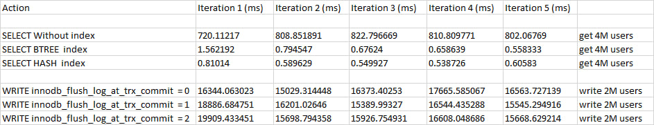
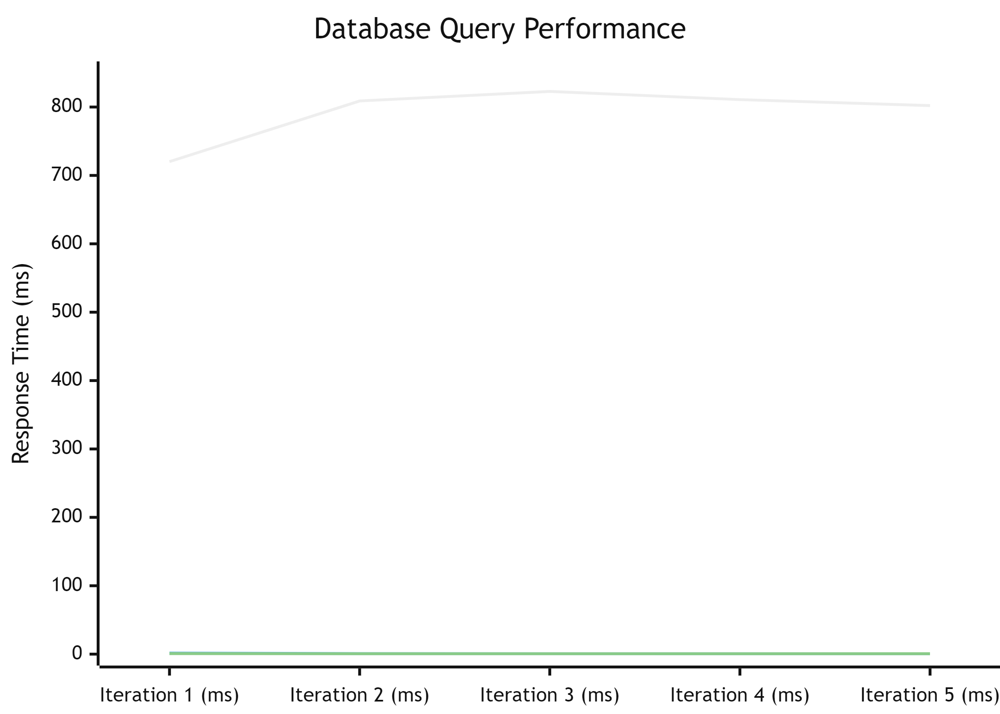
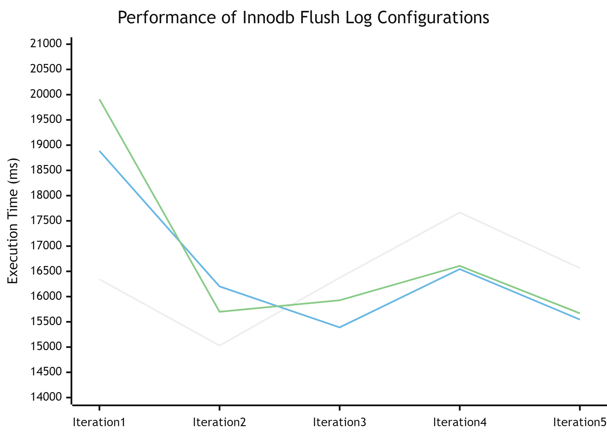

# HSA_SQL-Databases

## Results table
 

## Select data graph
 

## Write data graph
 

## Based on the table, the conclusion can be summarized as follows:

### Reading data:
- Reading without an index takes significantly more time compared to reading with indexes. This confirms that indexes greatly improve the speed of SELECT operations, reducing execution time by several times.

### Writing data:
- Writing with the parameter innodb_flush_log_at_trx_commit = 0 has the longest execution time, indicating that this parameter might impact write speed but its use can lead to data loss in case of a failure.
- Writing with the parameter innodb_flush_log_at_trx_commit = 1 shows better results compared to parameter 0, as this parameter ensures data is written to disk with each transaction, improving reliability but possibly reducing speed.
- Writing with the parameter innodb_flush_log_at_trx_commit = 2 yields intermediate results, suggesting a trade-off between speed and reliability: data is written to disk but not with every transaction, providing a better balance between speed and reliability.
